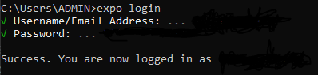
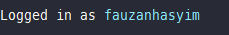
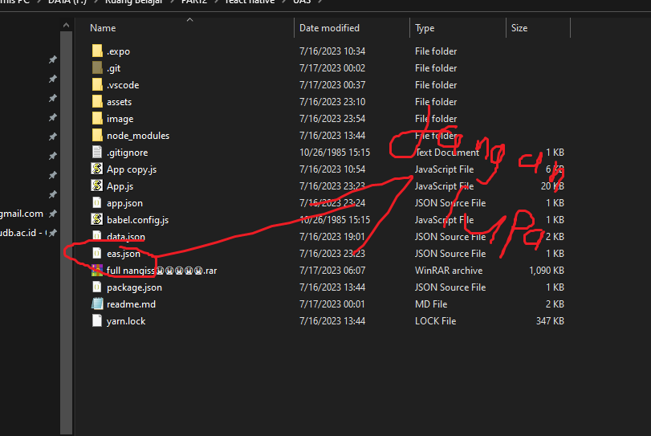
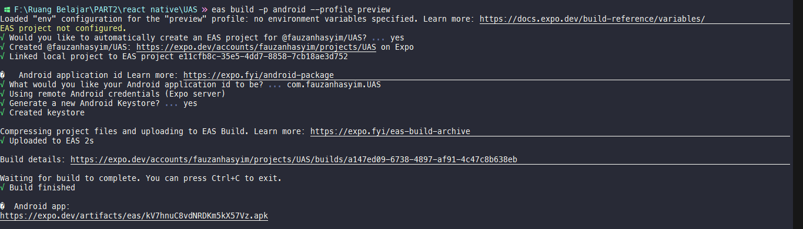

# 🖐🏻 Cara install

```
npm i || yarn
```

tunggu sampe mampus😭😭

trus

```
 yarn expo start
```

buat jalaninnya

oh ya btw ini gw pake expo ya biar gk suloyo pas installasinya XD

abis tu...

# **😭 Cara deploy jadiin apk**

install expo CLI dulu, caranya yaaa carii sendirii huuu manjaaaa...

udah zaman chatgpt...

trus di cek apakah udah keinstall

```
 expo -V
```

trus install EAS

```
npm install --global expo-cli eas-cli
```

trus bikin/login akun dulu [Disini](https://expo.dev/signup)

trus buka terminal

```
expo login
```



buat cek luu udah login apa blom?

```
expo whoami
```



nahh trus buat satu file namnya `eas.json `



truss copass ini...

```

{
  "build": {
    "preview": {
      "android": {
        "buildType": "apk"
      }
    },
    "preview2": {
      "android": {
        "gradleCommand": ":app:assembleRelease"
      }
    },
    "preview3": {
      "developmentClient": true
    },
    "production": {}
  }
}
```

# lastttt

```
eas build -p android --profile preview
```



SEmogaa bermanfaat
